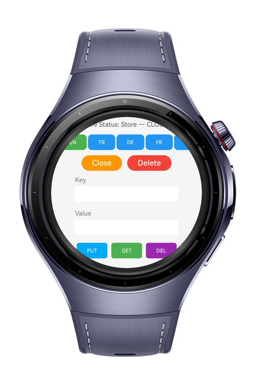
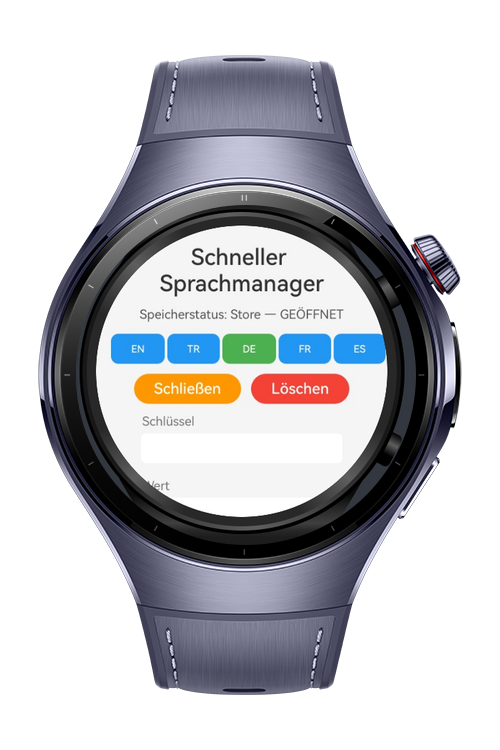
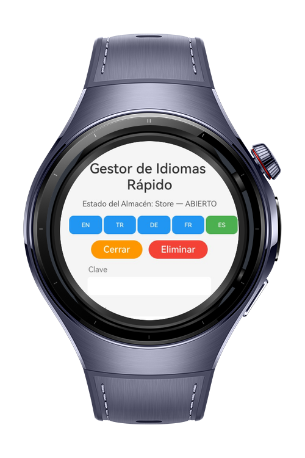

> **Note:** To access all shared projects, get information about environment setup, and view other guides, please visit [Explore-In-HMOS-Wearable Index](https://github.com/Explore-In-HMOS-Wearable/hmos-index).

# How To Make Localization Manager

**Quick Localization Manager** is a HarmonyOS wearable app that demonstrates **multi-language support**, **KV store operations**, and **dynamic UI updates**. It provides a lightweight interface for storing, retrieving, and deleting key value pairs while allowing users to switch app language on the fly. This project is designed as an educational demo for developers exploring **data persistence** and **localization
management** on HarmonyOS wearable devices.

# Preview

<div>
  
  
  
  
</div>

# Use Case Scenarios

- **Multi-language Support**: Supports **English, Turkish, German, French, and Spanish**, switchable at runtime with
  persistent storage of selected language.
- **KV Store Operations**: Demonstrates opening, closing, deleting, and managing a KV store instance.
- **Data Management**: Allows users to **PUT**, **GET**, and **DELETE** key-value pairs interactively.
- **Live Status Logging**: Displays last operation results with structured logging.
- **Lightweight UI**: Designed for wearable devices with clear, minimal controls.

# Tech Stack

- **Languages**: ArkTS, Typescript
- **Frameworks**: HarmonyOS SDK 5.1.0(18)
- **Tools**: DevEco Studio Version 5.1.0.828
- **Libraries**:
    - `@kit.ArkUI`
    - `@kit.BasicServicesKit`
    - `@kit.ArkData`

# Directory Structure

``` 
Quick Localization Manager
|--- entry/src/main/ets/
| |--- model/
| | |--- WordModel.ets
| |
| |--- pages/
| | |--- KvStoreDemo.ets
| | |--- KVStoreService.ets
| |
| |--- util/
| | |--- Constants.ets
| | |--- Logger.ets
| |
| |--- resources/
| |--- screenshots/
```

# Constraints and Restrictions

## **IDE and SDK**:

Requires **DevEco Studio** (version 5.1.0.240SP1 or higher).
Requires **HarmonyOS SDK** (API Version 16 Canary1 or above).

## **Usage Restrictions**:

KV store is local to the device; no cloud sync.
Logs are reset after each session.
Key size limited to **1024 bytes**.

## Supported Devices

- Huawei Watch 5

# LICENSE

**Quick Localization Manager** is distributed under the terms of the MIT License.
See the [license](/LICENSE) for more information.


